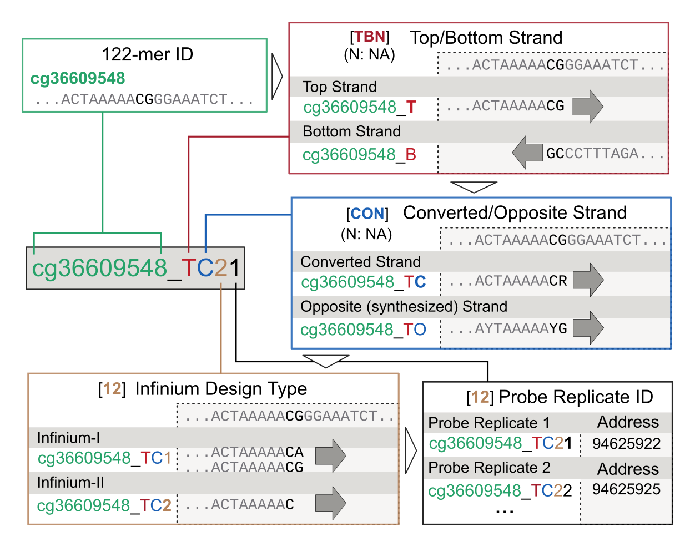

## The New Infinium BeadChip Probe ID System

The traditional Infinium probe ID (such as "cg0000029") does not uniquely specify the probe design. Two probes can share the same cg number and can cause confusion. Starting from the InfiniumMouse array (MM285), Illumina is adopting a new probe ID system that augments the existing probe ID with a suffix that specifies additional probe design details.

The following diagram specifies the meaning of each field in the appended suffix.

