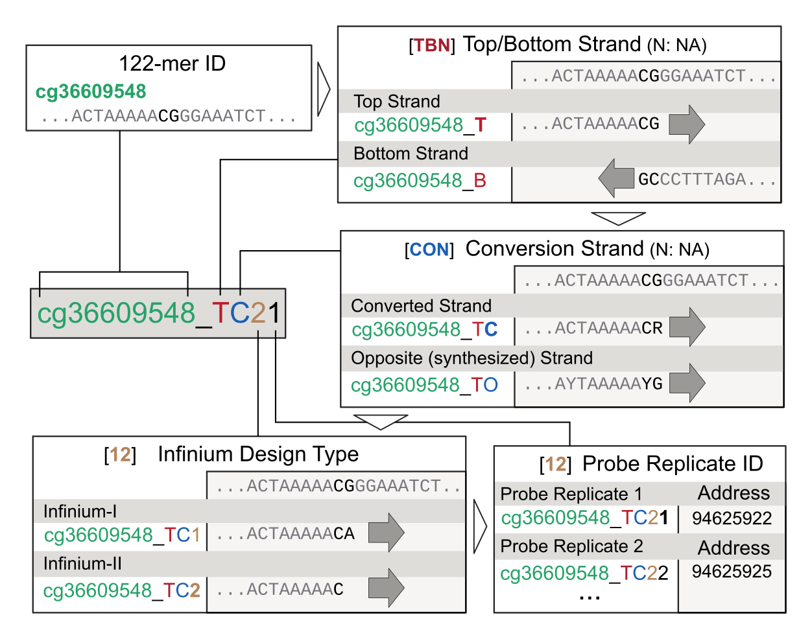

# Annotation for Infinium Arrays

# MouseMethylation (MM285)
### The official Illumina manifest
https://support.illumina.com/downloads/infinium-mouse-methylation-manifest-file-csv.html
https://support.illumina.com/content/dam/illumina-support/documents/downloads/productfiles/mouse-methylation/Infinium%20Mouse%20Methylation%20v1.0%20A1%20GS%20Manifest%20File.csv

### Our curated manifest
https://zwdzwd.s3.amazonaws.com/InfiniumAnnotation/current/MM285/MM285.mm10.manifest.tsv.gz

An example of reading mouse array IDATs from SeSAMe
```R
library(sesame)
mft <- readRDS(url("https://zwdzwd.s3.amazonaws.com/InfiniumAnnotation/current/MM285/MM285.mm10.manifest.rds"))
ssets <- lapply(searchIDATprefixes('path_to_IDAT_folder'), readIDATpair, manifest=mft, platform='MM285')
```

#### Column Description
- 1-3: chrm, beg, end of target, length 2 for CpG, length 1 for SNP and CpH. beg is 0-based and end is 1-based like in bed files.
- 4-5: tango address for M and U
- 6: target: CpG, the target reference allele
- 7: extension base
- 8: col: color channel, green or red
- 9: probe: ID
- 10: last: last base on 3'-end of the probe sequence, for Infinium-II CpG probe it will always be C
- 11-19: mapFlag, mapChrm, mapPos, mapQ, mapCigar, mapSeq, mapNM, mapAS, mapYD
- 20: lastB: last for B-allele for Infinium-I probes
- 21-29: mapFlag.B, mapChrm.B, mapPos.B, mapQ.B, mapCigar.B, mapSeq.B, mapNM.B, mapAS.B, mapYD.B
- 30: design category string

### Mouse Array ID system



# HorvathMammalMethylChip40 (Mammal40)

# HumanMethylationEPIC (EPIC)
Comprehensive annotation of Human Arrays (HM27, HM450, and EPIC) based on [Zhou et al. 2016 Nucleic Acid Res](https://academic.oup.com/nar/article/45/4/e22/2290930)
http://zwdzwd.github.io/InfiniumAnnotation
